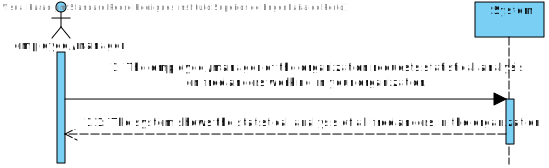
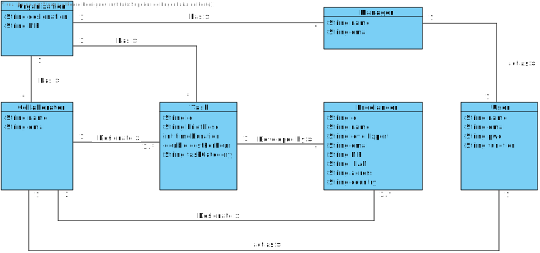
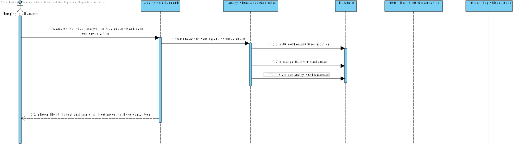
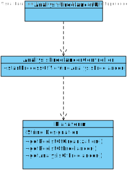

# UC4- Statistics Analysis of freelancers working for the organization

## 1. Requirements Engineering

### Brief Format

The Collaborator/manager of the organization **requests statistical analysis on freelancers working in your organization.**
The System **shows the statistical analysis of all freelancers in the organization.** and informs the sucess of the operation.

### SSD

### Full Format

#### Main actor

* Collaborator/Manager

#### Stakeholders and their interests

* **Collaborator/Manager:** wants statistical analysis on _Freelancers._

#### Preconditions
n/a

#### Post-conditions

* The statistical analysis on freelancers is presented to the Collaborator/Manager of the organization.

#### Main success scenario (or basic stream)

1. The Collaborator/manager of the organization **requests statistical analysis on freelancers working in your organization.**
2. The System **shows the statistical analysis of all freelancers in the organization.**

#### Extensions (or alternate streams)

*2a. There are no registered freelancers.
> The use case ends.

#### Special requirements
-

#### List of Technology and Data Variations
-

#### Frequency of Occurrence
-

#### Open questions

* The Collaborator/Manager has all the permissions to see all the Statistics?
* Should the _Freelancers(s)_ performance influence (negatively and/or positively) those Statistics?

## 2. OO Analysis

### Excerpt from the Relevant Domain Model for UC

## 3. Design - Use Case Realization

### Rational

| Main Flow | Question: Which Class... | Answer  | Justification  |
|:--------------  |:---------------------- |:----------|:---------------------------- |
|1. The Collaborator/manager of the organization **requests statistical analysis on freelancers working in your organization.**|...interact with the user?	| AnalysisFreelancerUI |Pure Fabrication|
| |...coordinates the UC?	| AnalysisFreelancerController |Controller|
|2.The System **shows the statistical analysis of all freelancers in the organization.**|... validates _Freelancer_ data (local validation)|RequestAnalysis||

### Systematization ##

It follows from the rational that the conceptual classes promoted to software classes are:

 * Plataforma
 * Organizacao
 * Colaborador
 * EnderecoPostal

Outras classes de software (i.e. Pure Fabrication) identificadas:

 * AnalysisFreelancerUI
 * AnalysisFreelancerController

###	Diagrama de Sequência

###	Diagrama de Classes

