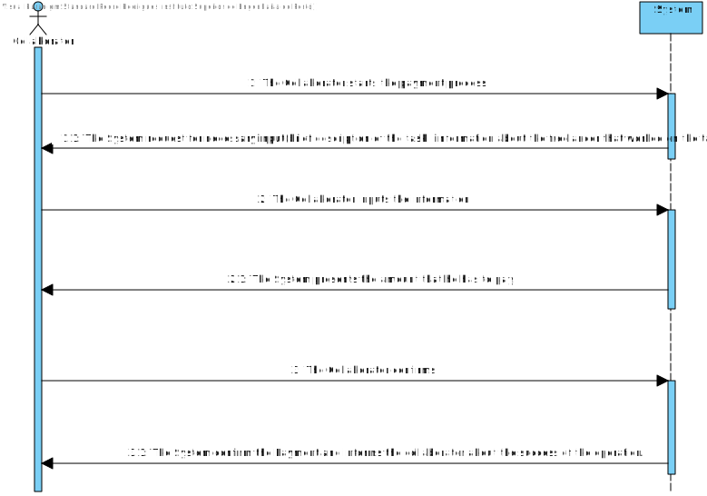
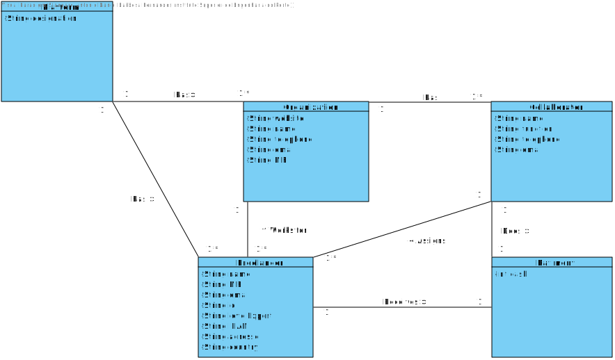
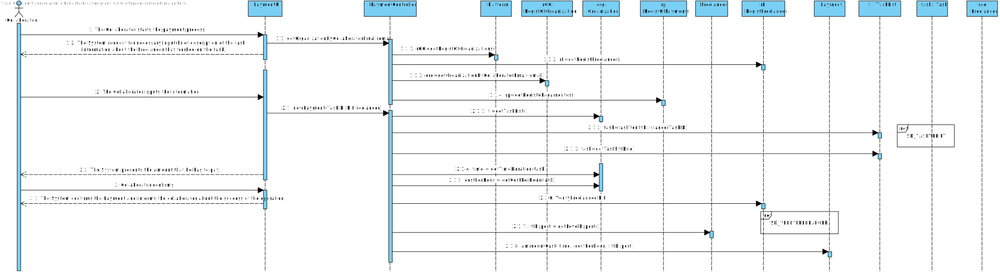
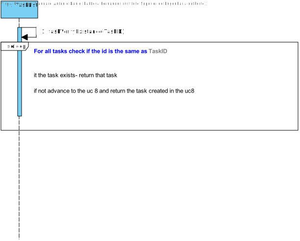
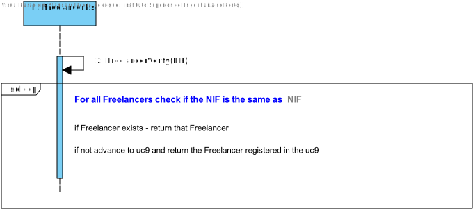
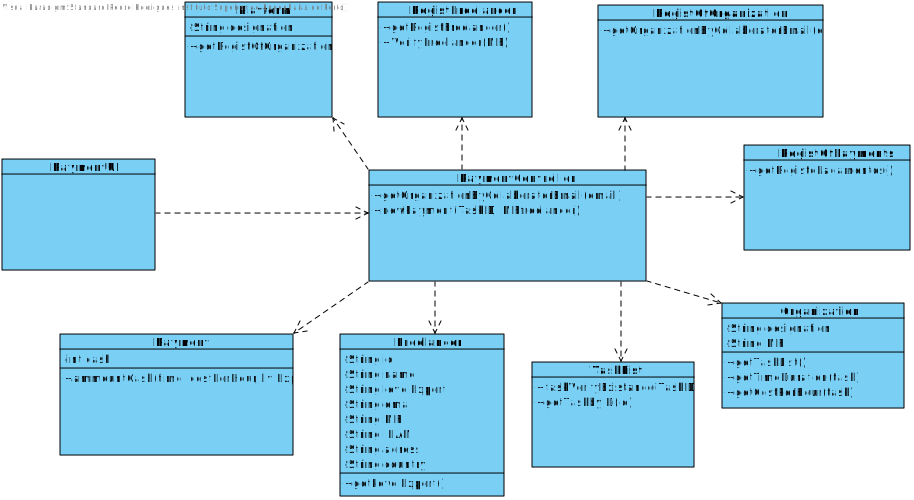

# UC5 - Payment of Freelancer

## 1. Requirements Engineering

### Short Format
The Collaborator starts the payment process. The System request for **necessary input(brief description of the task, information about the _Freelancer_ that worked on the task).**. The Collaborator inputs the information.
The System presents the amount that he has to pay. The Collaborator confirms. The System **confirms the Payment and informs the collaborator about the success of the operation.**

### SSD

### Full Format

#### Main actor

* Collaborator

#### Stakeholders and their interests

* **Freelancer:** wants to get paid for doing his job successfully.
* **Collaborator:** wants to pay his freelancer(s) for doing the job he/she assigned.

#### Preconditions

* _Freelancer(s)_ must be registered in the Platform.
* _Freelancer(s)_ must have his/her job done.

#### Post-conditions

* The _Freelancer_ gets paid.

#### Main success scenario (or basic stream)

1. Collaborator starts the payment process.
2. The System request for necessary **input(brief description of the task, information about the _Freelancer_ that worked on the task).**
3. The Collaborator inputs the information.
4. The System presents the amount that he has to pay.
5. Collaborator confirms.
6. The System **confirms the Payment and informs the collaborator about the success of the operation.**

#### Extensions (or alternate streams)

*a. The Collaborator requests the cancellation of the registration of the Freelancer.

> The use case ends.

3a. The System detects that there are missing mandatory minimum data.
>	1. The system informs you which data is missing.
>	2. The system allows the entry of missing data (step 2).
>
	>	2a. The Collaborator does not change the data. The use case ends.

3b. The system detects that the data entered is invalid.
>	1. The System alerts the Collaborator to the fact.
>	2. The system allows the entry of missing data (step 2).
>
  >	2a. The Collaborator does not change the data. The use case ends.

#### Special requirements

a. An option to make the text larger.

#### List of technology and data variations.

a. Each time a new freelancer is registered in the system.
b. Each time a task is assigned to a freelancer.

#### Frequency of Occurrence

a. Each time a collaborator pays a freelancer.

#### Open questions

## 2. OO Analysis

### Excerpt from the Relevant Domain Model for UC

## 3. Design - Use Case Realisation

### Rational

| Principal flux | Question: Which class... | Answer | Justification  |
|:--------------  |:---------------------- |:----------|:--|
|1. Collaborator starts the payment process. |... interact with user?  |PaymentUI | Pure Fabrication |
||  ...coordinates the UC? | PaymentController | Controller |
|| ... create instances of Freelancer?	| RegistFreelancer	| Creator(regra1): combined with HC + LC on Platform.|
|| ... create instances of Payments?    | RegistOfPayments	| Creator(regra1): combined with HC + LC on Platform.|
|| ... create instances of Organization? | RegistOfOrganization | Creator(regra1): combined with HC + LC on Platform.|
|2. The System request for **necessary input(brief description of the task, information about the _Freelancer_ that worked on the task).**|
|3. The Collaborator inputs the information. | ... store the data entered? | Task| IE: instance created in step 1. |
|| ...validates the task (local validation)  | Organization | IE Organization contains / aggregates task.|
|| ...validates the task (global validation) | TaskList | IE: TaskList has registered Task. |
|4. The System presents the amount that he has to pay.|  ... computes the amount to pay? | Payment| IE: In the DM the Freelancer receives Payment.|
|5. Collaborator confirms.|
|6. The System **confirms the Payment and informs the collaborator about the success of the operation.** | ...store the Payment? | RegistOfPayments | E: In the DM the Freelancer receives Payment. |
|| ... store the Freelancer? | RegistFreelancer |
|| ... store the Organization? | RegistOfOrganization |

### Systematisation ##

It follows from the rational that the conceptual classes promoted to software classes are:

 * Platform
 * Organization
 * Collaborator
 * Payment
 * Freelancer

 Other software classes (i.e. Pure Fabrication) identified:

 * PaymentUI
 * PaymentController
 * RegistFreelancer
 * RegistOfPayments
 * RegistOfOrganization

 ### Sequence Diagram

###	Class Diagram

