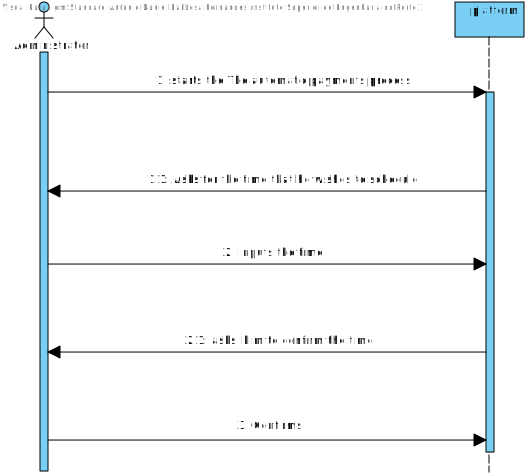
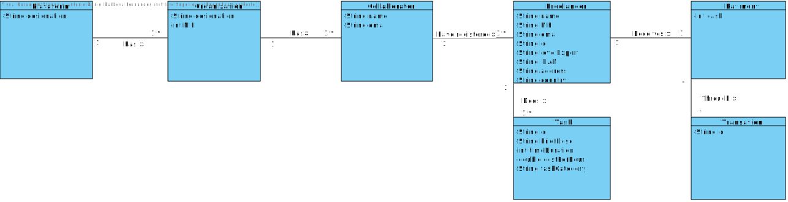
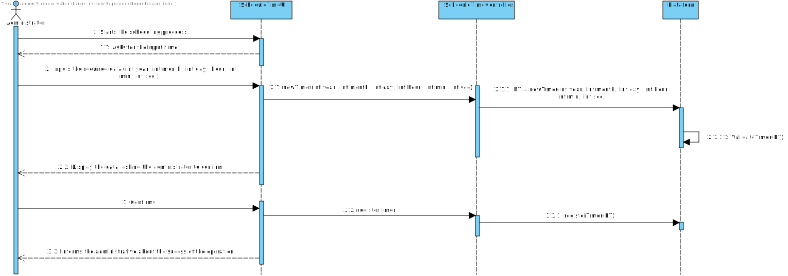
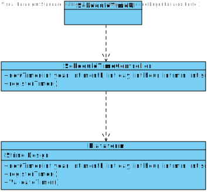

# UC6 - Scheduled Payment

## 1. Requirements Engineering

### Short Format

The automatic payments will be made automatically by the system whenever we arrive to the time scheduled by the manager of the organization. The payment will be made by bank transfer to the freelancer account and the freelancer will also receive one e-mail with a receipt describing the amount to pay for each task and the overall payment value.

### SSD

### Full Format

#### Main actor

* Administrator

#### Stakeholders and their interests

**Administrator:** wants to pay all freelancers that have done their job (at a Scheduled time).

#### Preconditions
n/a

#### Post-conditions
The freelancer gets paid at scheduled time.

#### Main success scenario (or basic stream)

1. The Administrator starts the scheduling.
2. Inputs the time he wants to schedule the payment.
3. Inputs the time he wants to schedule the payment
4. Done.

#### Extensions (or alternative fluxes)

*a. The system is down or in maintenance.

> The use case finishes.

1a. The systems crashes while scheduling.
>	1. The system reboots.
>	2. The system allows the user to schedule the payment again.
  >	2a. The Administrator doesn't input the time. The use case finishes.

2a. The system crashes.
>	1. The system reboots.
>	2. The system allows the user to schedule the payment again.
  > 2a. The Administrator\ doesn't input the time. The use case finishes.

3a. The system fails delivering the money or the Administrator entered the wrong data.

> The use case finishes.

#### Special Requirements
\-

#### List of technology and data variations.
\-

#### Frequency of Occurrence

Each time an Administrator wants to change the schedule.

#### Open questions

## 2. OO Analysis

### Excerto do Modelo de Domínio Relevante para o UC

## 3. Design - Use Case realisation
**
### Racional
| Principal flux | Question: Which class... | Answer | Justification  |
|:--------------  |:---------------------- |:----------|:--|
1. The Administrator starts the scheduling.| ... the Administrator interacts with|scheduleUI| Pure Fabrication|
||  ...controls the UC | scheduleController | Controller
|2. The System asks for required input|
|3. Inputs the time he wants to schedule the payment.|...receives the input | scheduleController | Ie
|4. Done.

###	Diagrama de Sequência

###	Diagrama de Classes

