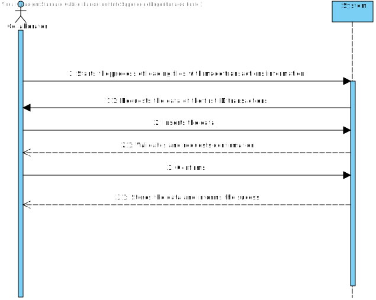
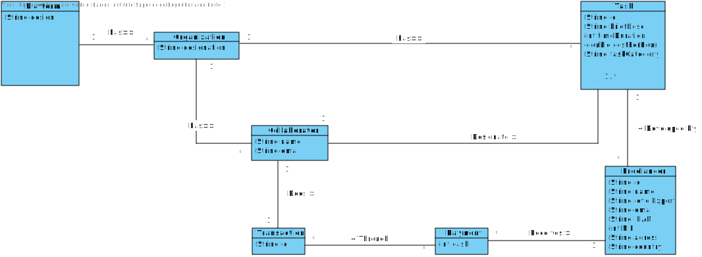
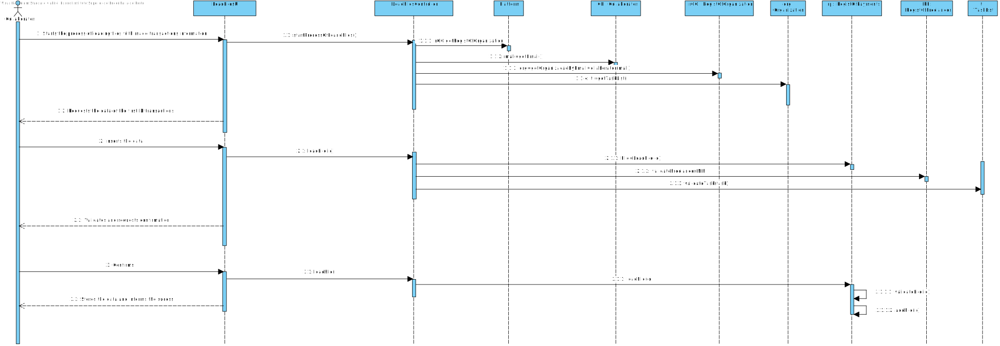
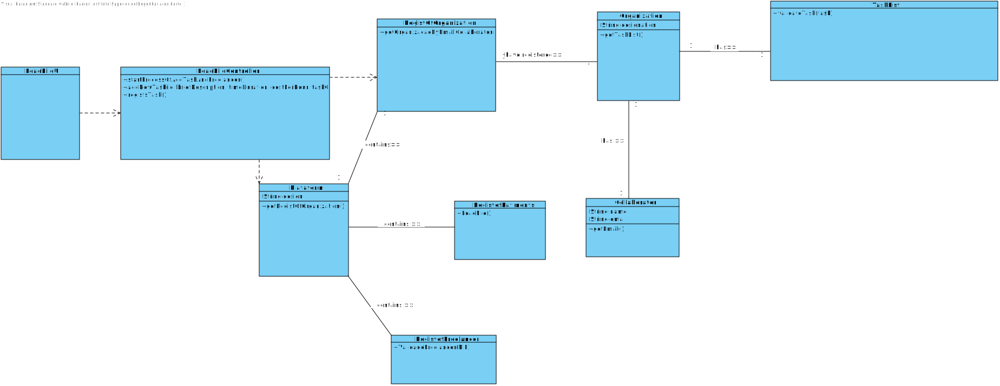

# UC7 - Load files with made transactions information
Carregar arquivos com informações de transações efetuadas

## 1. Engenharia de Requisitos

### Short Format

Collaborator starts the process of loading files with made transactions information. The System requests **the data of the first ID transactions**. Collaborator inserts the data. The system **validates and asks for confirmation.** The collaborator confirms. The system **load the file and informs the success.**

### SSD

### Full Format

#### Main Actor

Manager or Collaborator

#### Interessed parts and their interests
**Manager or Collaborator** - Wants to see the transactions historical.
**T4J:** Wants to keep updated about the statistics provided by the managers or collaborators.

#### Preconditions
n/a

#### Post-conditions
A informação do registo é guardada no sistema.

#### Cenário de sucesso principal (ou fluxo básico)

1. Collaborator starts the process of loading files with made transactions information.
2. The System requests **the data of the first ID transactions**.
3. Collaborator inserts the data.
4. The system **validates and asks for confirmation**.
5. The collaborator confirms.
6. The system **load the file and informs the success.**

#### Extensões (ou fluxos alternativos)

*a. O utilizador não registado solicita o cancelamento da leitura.

> O caso de uso termina.

4a. ID inexistente.
>	1. O sistema informa quais os dados incorretos.
>	2. O sistema permite a correção dos dados.
>
	>	2a. O utilizador não registado não altera os dados. O caso de uso termina.

4b. Dados mínimos obrigatórios em falta.
>	1. O sistema informa quais os dados em falta.
>	2. O sistema permite a introdução dos dados em falta (passo 3)
>
	>	2a. O utilizador não registado não altera os dados. O caso de uso termina.

4c. O sistema deteta que os dados (ou algum subconjunto dos dados) introduzidos devem ser únicos e que já existem no sistema.
>	1. O sistema alerta o utilizador não registado para o facto.
>	2. O sistema permite a sua alteração (passo 3)
>
	>	2a. O utilizador não registado não altera os dados. O caso de uso termina.

#### Requisitos especiais
\-

#### Lista de Variações de Tecnologias e Dados
\-

#### Frequência de Ocorrência
\-

#### Questões em aberto

* Existem outros dados obrigatórios para além dos já conhecidos?
* Quais os dados que em conjunto permitem detetar a duplicação de organizações (e de gestores)?
* É necessário existir algum mecanismo de segurança adicional para confirmar que a organização existe e é representada pela pessoa que a registou?
* Quais são as regras de segurança aplicaveis à palavra-passe?
* Qual a frequência de ocorrência deste caso de uso?

## 2. Análise OO

### Excerto do Modelo de Domínio Relevante para o UC

## 3. Design - Realização do Caso de Uso

### Racional

| Fluxo Principal | Questão: Que Classe... | Resposta  | Justificação  |
|:--------------  |:---------------------- |:----------|:---------------------------- |
|1. Collaborator starts the process of loading files with made transactions information.|...interact with the user?|LoadFileUI|Pure Fabrication|
|| ... coordinates the UC?|LoadFileController|Controller|
|| ... creates the Load instances? | RegisterofPayments | Creator (rule1): combined with HC + LC on Organization. |
|2. The System requests **the data of the first ID transactions**.||||
|3. Collaborator inserts the data.|...save the data entered?|Payments| In the DM the Payments create transactions.|
|||RegisterofPayments|Por aplicação de HC+LC delega a RegisterofPayments|
|||Payments|IE: Payments conhece os seus dados|
|4. The system **validates and requests confirmation.**| ... validates the data of the file (local validation)? | Payments | IE: has its own data |
|| ... validates the data of file (global validation)? | RegisterofPayments| IE: In the DM the Payments create transactions. |
|5. Collaborator confirms.||||
|6. The System **stores the data and informs the success.**|...save the File data?|Organization|IE: In the DM the Organization has transactions.|
|||RegisterofPayments|IE: In the DM the RegisterofPayments have the Payments. By aplication of HC+LC delegates a RegisterofPayments.|
||...informs of the success of the operation?|RegisterofPaymentsUI||

### Sistematização ##

 Do racional resulta que as classes conceptuais promovidas a classes de software são:

 * Plataform
 * Organization
 * Collaborator
 * Adress

Outras classes de software (i.e. Pure Fabrication) identificadas:  

 * LoadFileUI  
 * LoadFileController

###	Diagrama de Sequência

###	Diagrama de Classes

