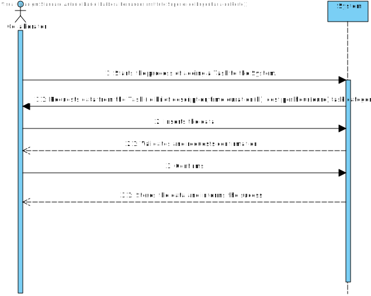
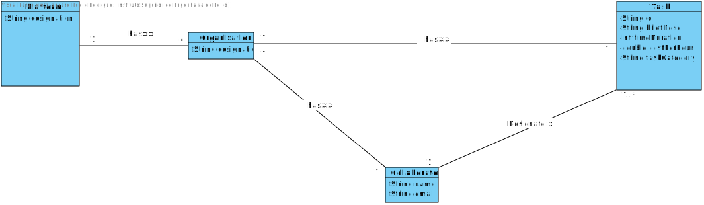
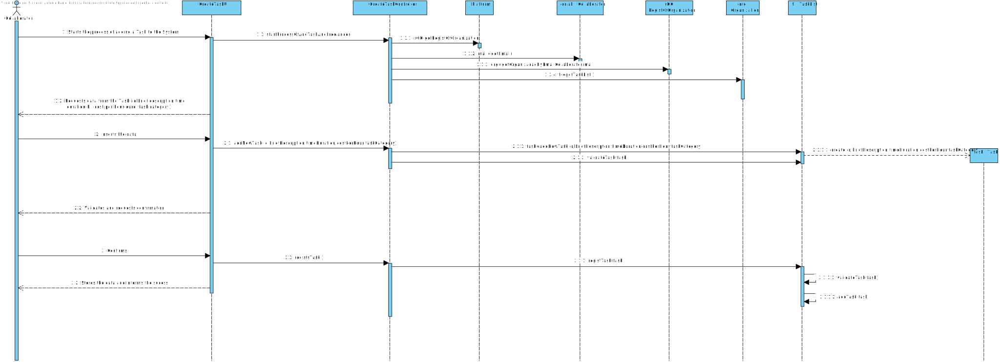
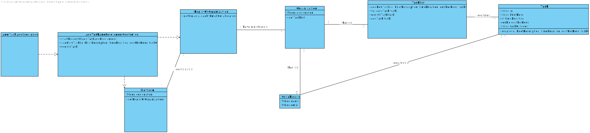

# UC8 - Create Task
## 1. Requirements Engineering

### Brief Format

Collaborator starts the process of adding a Task to the System. The System requests **data from the Task (id, brief description, time duration(h), cost per hour(euro),task category).**
Collaborator inserts the data.  The system **validates and asks for confirmation.** The collaborator confirms. The system **stores the data and informs the success.**

### SSD

### Full Format

#### Main actor

* Collaborator

#### Stakeholders and their interests

* **Collaborator:** have registered the task in system.
* **_Freelancer_:** being available to developing tasks.

#### Preconditions

* Existence of _Freelancers_ registered for developing tasks.
* Have a task registered in the System.

#### Post-conditions

#### Main success scenario (or basic stream)

1. Collaborator starts the process of adding a Task to the System.
2. The System requests **data from the Task (id,brief description,time duration(h), cost per hour(euro),task category).**
3. Collaborator inserts the data.
4. The system **validates and requests confirmation.**
5. Collaborator confirms.
6. The System **stores the data and informs the success.**

#### Extensions (or alternate streams)

*a. Collaborator requests the cancellation of registration.

> The use case ends.

3a. The System detects that there are missing mandatory minimum data.
> 1. The system tells you what data is missing.
> 2. The system allows the entry of the missing data (step 2).
>
	> 2a. Collaborator does not change the data. The use case ends.

3c. The system detects that the data (or some subset of the data) entered must be unique and that it already exists in the system.
> 1. The system alerts the unregistered user to the fact.
> 2. The system allows its change (step 2)
>
	> 2a. Collaborator does not change the data. The use case ends.

#### Special requirements
\-

#### List of Technology and Data Variations
\-

#### Frequency of Occurrence
\-

#### Open questions

* What data together can detect the duplication of tasks?
* Are there any other mandatory data other than those already known?

## 2. OO Analysis

### Excerpt from the Relevant Domain Model for UC

## 3. Design - Use Case Realization

### Racional

| Main Flow | Question: Which Class... | Answer  | Justification  |
|:--------------  |:---------------------- |:----------|:---------------------------- |
|1. Collaborator starts the process of adding a Task to the System.|...interact with the user?|CreateTaskUI|Pure Fabrication|
|| ... coordinates the UC?|CreateTaskController|Controller|
|| ... creates the Task instances? | TaskList | Creator (rule1): combined with HC + LC on Organization. |
|2. The System requests **data from the Task (id,brief description,time duration(h), cost per hour(euro),task category).**||||
|3. Collaborator inserts the data.|...save the data entered?|Organization| In the DM the Organization create Task.|
|||TaskList|Por aplicação de HC+LC delega a TaskList|
|||Task|IE: Task conhece os seus dados|
|4. The system **validates and requests confirmation.**| ... validates the data of the Task (local validation)? | Task | IE: has its own data |
|| ... validates os dados da Task (global validation)? | TaskList | IE: In the DM the Organization create Tasks. By aplication of HC+LC delegates a TaskList. |
|5. Collaborator confirms.||||
|6. The System **stores the data and informs the success.**|...save the Task data?|Organization|IE: In the DM the Organization has Task.|
|||TaskList|IE: In the DM the Organization has Tasks. By aplication of HC+LC delegates a TaskList.|
||...informs of the success of the operation?|CreateTaskUI||

### Systematization ##

 It follows from the rational that the conceptual classes promoted to software classes are:

 * Organization
 * Task

Other software classes (i.e. Pure Fabrication) identified:

 * CreateTaskUI
 * CreateTaskController
 * TaskList

###	Sequence Diagram

###	Class Diagram

