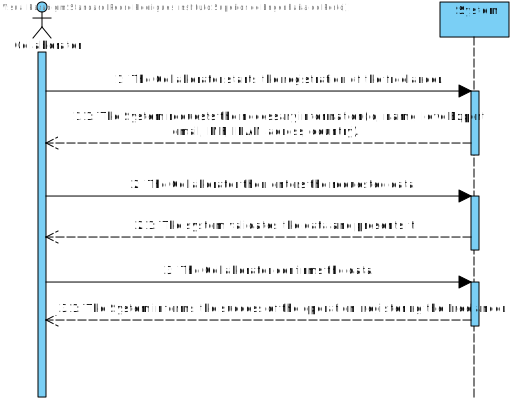
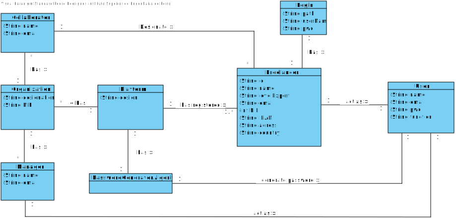
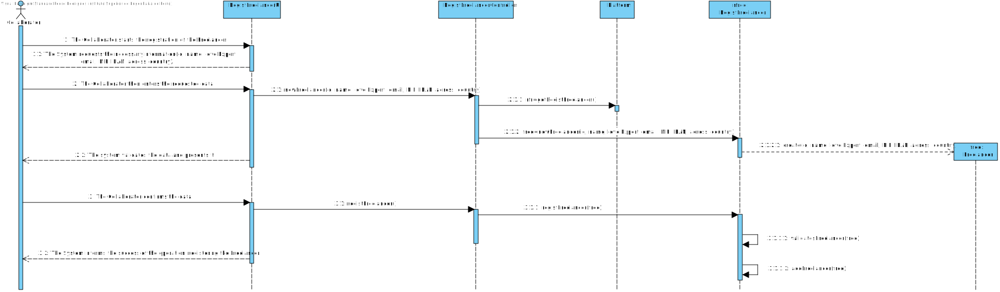
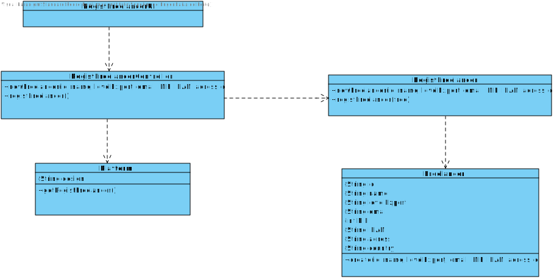

# UC9 - Regist Freelancer

## 1. Requirements Engineering

### Short Format

The Collaborator starts the registration of the _Freelancer._ The System **requests the necessary information(id, name, levelExpert, email, NIF, IBAN, adress, country).** The Collaborator then enters the requested data. The system validates the data and presents it.
The Collaborator confirms the data. The System **informs the success of the operation, registering the _Freelancer._**

### SSD

### Full Format

#### Main actor

* Collaborator

#### Stakeholders and their interests

* **Collaborator:** person responsible to regist _Freelancer_ in the Platform.
* **_Freelancer_:** want to be registered on the platform and chosen for the task.

#### Preconditions

* The existence of recognized _Freelancers_ for task development.

#### Post-conditions

* There must be minimal information to register _Freelancer(s)_.
* A user is created on the platform for Freelancer.

####  Main success scenario (or basic stream)

1. The Collaborator starts the registration of the _Freelancer._
2. The System **requests the necessary information(id, name, levelExpert, email, NIF, IBAN, adress, country).**
3. The Collaborator then enters the requested data.
4. The system validates the data and presents it.
5. The Collaborator confirms the data.
6. The System **informs the success of the operation, registering the Freelancer.**

#### Extensions (or alternate streams)

*a. The Collaborator requests the cancellation of the registration of the Freelancer.

> The use case ends.

3a. The System detects that there are missing mandatory minimum data.
>	1. The system informs you which data is missing.
>	2. The system allows the entry of missing data (step 2).
>
	>	2a. The Collaborator does not change the data. The use case ends.

3b. The system detects that the data entered must be unique and that it already exists in the system.
>	1. The System alerts the Collaborator to the fact.
>	2. The system allows the entry of missing data (step 2)
>
	>	2a. The Collaborator does not change the data. The use case ends.

3c. The system detects that the data entered is invalid.
>	1. The System alerts the Collaborator to the fact.
>	2. The system allows the entry of missing data (step 2).
>
	>	2a. The Collaborator does not change the data. The use case ends.

#### Special requirements
\-

#### List of Technology and Data Variations
\-

#### Frequency of Occurrence
\-

#### Open questions

* Are there other data that are needed?
* Are all required data required?
* Are all the requested data valid?
* Is there a freelancer who does not meet the mandatory minimum requirements?

## 2. OO Analysis

### Excerpt from the Relevant Domain Model for UC

## 3. Design - Use Case Realization

### Rational

| Main Flow | Question: Which Class... | Answer  | Justification  |
|:--------------  |:---------------------- |:----------|:---------------------------- |
|1. The Collaborator starts the registration of the _Freelancer._|...interact with the user?| RegistFreelancerUI |Pure Fabrication|
| |...coordinates the UC?| RegistFreelancerController |Controller|
| |... create instances of Freelancer?|RegistFreelancer|Creator(regra1): combined with HC + LC on Platform.|
|2. The System **requests the necessary information(id, name, levelExpert, email, NIF, IBAN, adress, country).**||||
|3. The Collaborator then enters the requested data. |... store the data entered?|Freelancer|IE: instance created in step 1|
|4.The system validates the data and presents it. |... validates Freelancer data (local validation)|Freelancer|IE: has its own data|
| |... validates Freelancer data (global validation)|RegistFreelancer|IE: RegistFreelancer has registered Freelancer|
|5. The Collaborator confirms the data. ||||
|6. The System **informs the success of the operation, registering the Freelancer.**|... save the Freelancer created?| RegistFreelancer |IE: In the DM the Platform has Organization.|
| |... regist/store the User referring to Freelancer?|AutorizationFacade|IE. User management is the responsibility of the respective external component whose point of interaction is through the class "AutorizationFacade"|

### Systematization ##

 It follows from the rational that the conceptual classes promoted to software classes are:

 * Platform
 * Organization
 * Collaborator

Other software classes (i.e. Pure Fabrication) identified:

 * RegistFreelancerUI
 * RegistFreelanerController
 * RegistFreelancer

###	Sequence Diagram

###	Class Diagram

